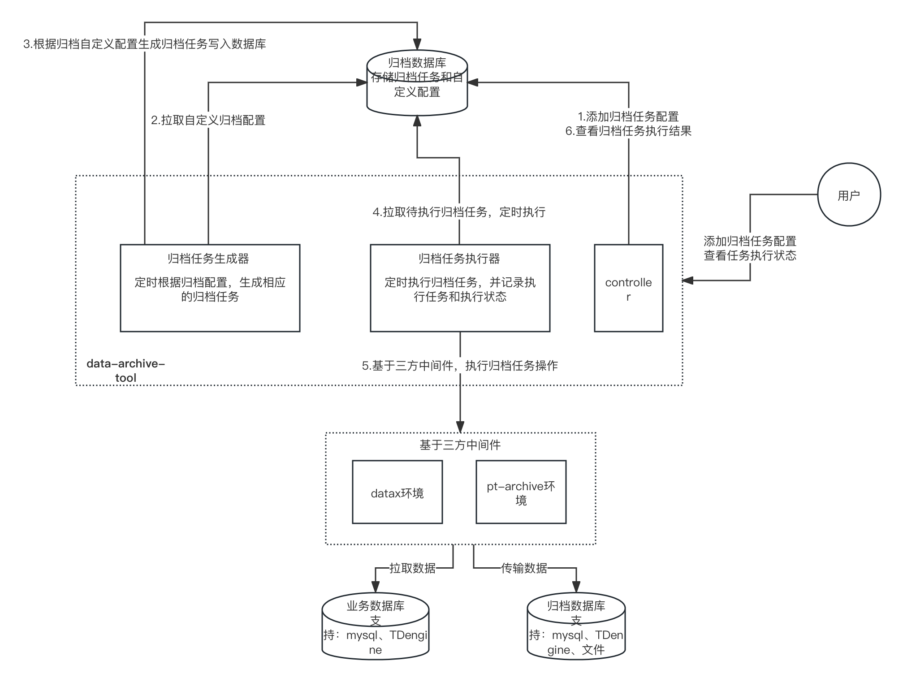

# 工程简介

data-archive-tool 是一个基于pt-archiver、datax之上，封装的通用数据归档工具。

### data-archive-tool能做什么？

- 支持多个不同的数据源进行归档
- 支持多种归档策略
    - 归档至DB数据库
    - 归档至文件
    - 直接删除
- 支持手动/自定义定时调度时间
- 支持MySQL、TDengine数据源归档

### data-archive-tool的架构图



# 延伸阅读

### 运行环境：

- JDK8
- linux（CentOS 7）
- MySQL 5.7
- [pt-archiver](docs/pt-archiver.md)
- [datax](docs/datax.md)

### 如何安装data-archive-tool？

#### （5）下载源码后使用Maven编译器进行编译：

```
mvn clean package
```

data-archive-tool/target中可以看到可运行的jar

#### （6）初始化data-archive-tool的DB

```
通过MySQL命令运行：data-archive-tool/db/mysql_archiver.sql
```

### 如何启动data-archive-tool?

#### （1）配置data-archive-tool的程序配置application.yml，将它放到/opt/archiver目录下（为了方便演示存放在/opt/archiver，用户可以更改配置存放路径）

```

## 归档规则配置和归档任务的DB地址
spring:
  datasource:
    type: com.zaxxer.hikari.HikariDataSource
    driver-class-name: com.mysql.cj.jdbc.Driver
    url: jdbc:mysql://ip:3306/mysql_archiver?useUnicode=true&characterEncoding=utf-8&useSSL=false&serverTimezone=GMT&allowMultiQueries=true
    username: root
    password: 123qweASD
    max-active: 100

## mysql归档配置
archive:
  ## pt-archiver 程序的安装路径
  pt-archiver-path: /opt/homebrew/bin
  
  ### 业务数据库和归档数据库都需要创建一个归档账号
  ## 归档账号
  archive-user: root
  ## 归档密码
  archive-pwd: 123qweASD

  ## 归档到DB（会删源数据）模式配置
  archive-config:
    ## 批量每次归档的数据数量
    batch-size: 20000
    ## 指定每个事务的大小（行数）
    txn-size: 1000
    
  ## 归档到file（会删源数据）模式配置 
  archive-to-file-config:
    ## 归档为文件时，文件的存放路径（注意需要给该路径赋予读写权限）
    archive-file-path: /opt/archive
    ## 批量每次归档的数据数量
    batch-size: 20000
    ## 指定每个事务的大小（行数）
    txn-size: 500
    
  ## 直接删除模式配置
  delete-config:
    ## 批量每次归档的数据数量
    batch-size: 20000
    ## 指定每个事务的大小（行数）
    txn-size: 1000

## tdengine归档配置（基于datax同步，默认不会删除数据）
tdengine:
  ## datax程序的安装路径
  datax-path: /Users/pengcheng/Downloads/datax
  archive-user: root
  archive-pwd: kA7zfTpd2T
  ## 归档到DB模式配置
  tdengine-config:
    batch-size: 1000
    ignore-tags-unmatched: false
  ## 归档到file模式配置
  tdengine-to-file-config:
    write-mode: truncate
    date-format: yyyy-MM-dd HH:mm:ss
    archive-file-path: /Users/pengcheng/Downloads/datax/bin
    
.... 略去其他的配置    

```

#### （2）启动data-archive-tool

```
nohup java -jar -Dspring.config.location=/opt/archiver/application.yml data-archive-tool-1.0.0.jar > log.file  2>&1 &
```

### 如何使用data-archive-tool?

#### （1）添加归档策略

```
curl --location 'localhost:8080/api/archive/config/save' \
--header 'Content-Type: application/json' \
--data '{
            "archiveType": "mysql",
            "sourceHost": "10.128.29.232",
            "sourcePort": 3306,
            "sourceDb": "smart_transport",
            "sourceTable": "goods",
            "sourceTableColumn": null,
            "destHost": "10.128.29.232",
            "destPort": 3306,
            "destDb": "smart_transport",
            "destTable": "goods",
            "destTableColumn": null,
            "archiveMode": "ARCHIVE_TO_FILE",
            "charset": "none",
            "archiveCondition": "create_time >= '\''${lastMonthStartTimestamp}'\'' and create_time <= '\''${lastMonthEndTimestamp}'\''",
            "execTimeWindowCron": "0 0 2 1 * ? *",
            "priority": 1,
            "beginDateTime": null,
            "endDateTime": null,
            "isEnable": 1,
            "remark": null,
            "extensionCmd": "--no-delete --ask-pass",
            "extensionProperties": "dataxPath=/Users/pengcheng/Downloads/datax,archiveUser=root,tdengineConfig.batchSize=100",
            "querySql":"select id, business_type, business_id, province, city, district, replace(address, ',', '，'), address_type, lon, lat, sort, delete_flag, null_work from business_address_bak where id <= 1000;"
        }'
```


| 字段名称                  | 字段描述  |
|-----------------------|---|
| archive_type          | 归档类型（枚举：mysql、tdengine）
| source_host           | 源服务器
| source_port           | 源服务器端口
| source_db             | 源数据库schema
| source_table          | 源数据库表
| source_table_column   | 源数据表字段，多个用英文逗号隔开(tdengine)
| dest_host             | 目标服务器
| dest_port             | 目标服务器端口
| dest_db               | 目标数据库schema
| dest_table            | 目标数据库表
| dest_table_column     | 目标数据表字段，多个用英文逗号隔开(tdengine)
| archive_mode          | 归档模式：ARCHIVE（归档）,DELETE(只删除不归档)，ARCHIVE_TO_FILE(归档到文件)
| priority              | 优化级，数值越高，在执行时间窗口的有多个任务时，优先执行
| charset               | 字符集，默认：UTF8
| archive_condition     | 归档条件（where条件）
| exec_time_window_cron | 执行时间窗口，如：0 0 2 1 * ? *, 表示在每月的1日的凌晨2点执行任务。**如果为空则需要手动出发归档任务**
| extension_cmd         | 归档扩展命令，可以自己加上特殊的pt-archiver命令
| extension_properties  | 归档配置扩展(application.yml中配置的增强，例子：dataxPath=/Users/pengcheng/Downloads/datax,archiveUser=root,tdengineConfig.batchSize=100)
| query_sql             | 查询sql（datax, 配置后会忽略 table, column, where, beginDateTime, endDateTime这些配置）
| .....                 | 略去其他不相关字段


针对archive_condition、query_sql字段，增强了时间处理逻辑。一般情况我们配置的条件基本上都是静态的，例如`create_time > '2024-04-01 00:00:00' and create_time < '2024-05-01 00:00:00'`，但是业务场景通常需要的是动态的，周期性变化的。

所以我们可以改写为`create_time > '${lastMonthStartTimestamp}' and create_time < '${lastMonthEndTimestamp}'`，然后再配合exec_time_window_cron参数就可以实现动态的数据归档。

| 字段名称                     | 字段描述  |
|--------------------------|---|
| periodStartTimestamp     | 周期开始时间（会根据配置的定时任务动态计算 exec_time_window_cron）
| periodEndTimestamp       | 周期结束时间（会根据配置的定时任务动态计算 exec_time_window_cron）
| lastDayStartTimestamp    | 昨天开始时间
| lastDayEndTimestamp      | 昨天结束时间
| lastWeekStartTimestamp   | 上周开始时间
| lastWeekEndTimestamp     | 上周结束时间
| lastMonthStartTimestamp  | 上月开始时间
| lastMonthEndTimestamp    | 上月结束时间
| last7DaysStartTimestamp  | 过去7天开始时间
| last7DaysEndTimestamp    | 过去7天结束时间
| last30DaysStartTimestamp | 过去30天开始时间
| last30DaysEndTimestamp   | 过去30天开始时间

#### （2）查询归档策略列表

```
curl --location 'localhost:8080/api/archive/config/list' \
--header 'Content-Type: application/json' \
--data '{
    "isEnable": 1
}'
```

#### （3）查询单个归档策略

```
curl --location 'localhost:8080/api/archive/config/get?id=3'
```

#### （4）触发归档任务生成器，生成归档任务

- 方式一：归档任务生成器会根据exec_time_window_cron的cron表达式自动生成
- 方式二：通过API手动触发生成，手动触发分为"触发全部"和"指定ip触发"，响应结果能拿到执行任务的编号。

```
curl --location 'localhost:8080/api/archive/tasks/generate'
```

```
curl --location 'localhost:8080/api/archive/tasks/manually/generate?ids=2,3'
```

#### （5）执行归档任务
- 方式一：归档任务执行器，会定时自动执行（大约每5分钟检查一次任务列表）
- 方式二：通过API手动触发执行
```
curl http://ip:8080/api/archive/tasks/execute
```

####  (6) 查看归档任务运行状态
```
curl --location 'localhost:8080/api/archive/tasks/execute/status?taskId=114'
```