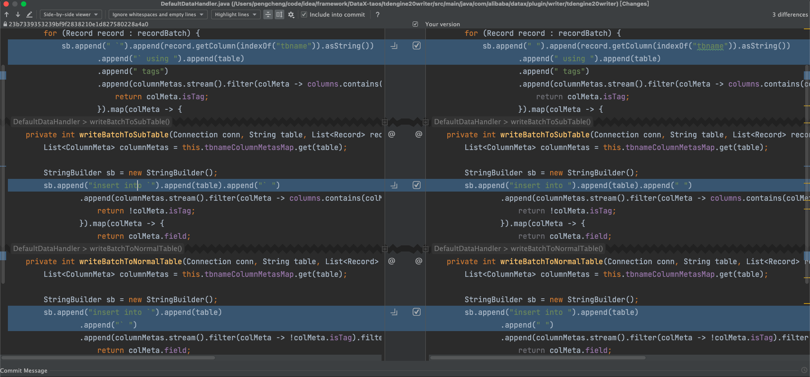

# datax 安装及使用

### 简介
alibaba提供的数据同步的中间件，具体参考[DataX](https://github.com/alibaba/DataX) 。

### 如何安装DataX？
由于tdengine的版本限制，无法直接使用alibaba官网的datax项目，需要依赖于taosdata用户下frock的项目。
[taosdata-datax](https://github.com/taosdata/DataX/blob/master/tdengine20writer/doc/tdengine20writer-CN.md)

#### 编译taosdata-datax

```
mvn -U clean package assembly:assembly -Dmaven.test.skip=true
```

由于验证过程中发现拼接的表名存在问题，所以对源码做了下列的修改：


#### 编译后jar拷贝到服务器


### 参考资料

#### 验证可行的方案
https://www.taosdata.com/tdengine-engineering/16401.html

#### 官方推荐方案，低版本不支持taosdump，建议升级当前分支的最高版本
https://www.taosdata.com/tdengine-engineering/17753.html